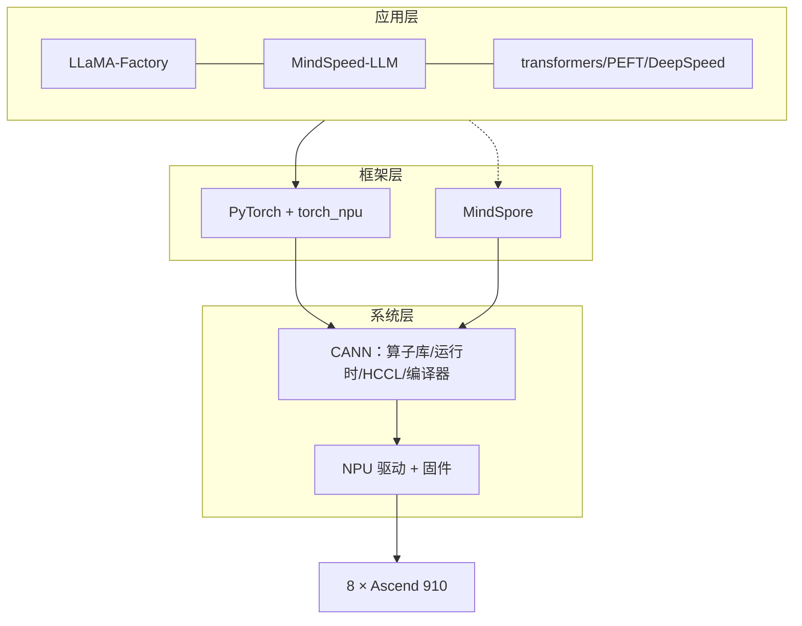

# 第 0 章 · 昇腾 910 硬件与软件生态全景

> **本章目标**：搞清楚你手里这 8 张卡到底是什么、软件栈由哪几层组成、训练大模型有哪几条技术路线、分别适合什么场景。后面每一章都建立在这些概念之上。

## 0.1 你手里的硬件：Ascend 910 家族

「昇腾 910」不是一款芯片，而是一个家族。先分清自己是哪一代，因为**精度支持、显存大小、可用的加速特性都不一样**：

| | Ascend 910（910A） | Ascend 910B 系列 |
|---|---|---|
| 发布时间 | 2019 | 2023 起 |
| 典型整机 | Atlas 800 训练服务器（型号 9000/9010） | Atlas 800T A2、Atlas 900 A2 PoD |
| 单卡显存（HBM） | 32 GB | 多为 64 GB（910B4 为 32 GB） |
| FP16 算力 | 320 TFLOPS（官方值） | 因子型号而异（官方未统一公开，社区口径约 280–400 TFLOPS） |
| **BF16** | ❌ 不支持 | ✅ 支持 |
| FlashAttention 融合算子（`npu_fusion_attention`） | ❌ 不支持 | ✅ 支持 |
| 文档中的产品线称呼 | 「Atlas 训练系列产品」 | 「**Atlas A2 训练系列产品**」 |

> ✅ **怎么确认自己是哪一代？** 跑 `npu-smi info`，看 `Name` 列：`910B1/910B2/910B3/910B4` 是 910B 系列；只写 `910A` 或 `910` 的是第一代。看文档时注意：910B 对应文档里的「Atlas A2 训练系列产品」，很多融合算子、新特性都只支持 A2。

**对训练实践的直接影响：**

- **910B**：混合精度直接用 **BF16**，数值稳定、不需要 loss scaling，是当前大模型训练的默认选择。
- **910A**：只能用 **FP16 + 动态 loss scaling**，7B 以上模型容易遇到溢出问题，且单卡 32GB 显存更紧张。本教程的示例都能跑，但涉及 BF16 和融合注意力的部分需要按标注降级。

### 单机 8 卡的互联拓扑

一台 Atlas 800 里，8 张 NPU 之间通过华为自研的 **HCCS** 高速总线互联（对标 NVIDIA 的 NVLink），跨机则走每张 NPU 自带的 **200Gb RoCE 网口**（对标 InfiniBand）。这决定了一个重要事实：

> **机内通信远快于机间通信。** 单机 8 卡内做张量并行（TP）、大量 AllReduce 都没问题；一旦扩展到多机，并行策略就要重新设计（TP 不出机、跨机只走 DP/PP）。本教程聚焦单机 8 卡，多机差异会在第 6 章和附录里提示。

另外注意：多数 Atlas 训练服务器 CPU 是**鲲鹏（aarch64）**。装 Python 包时要用 aarch64 的 wheel；x86 的 conda 环境、你在自己电脑上导出的 `requirements.txt` 里的二进制包不能直接照搬。

## 0.2 软件栈：从驱动到训练框架

昇腾软件栈是分层的，**每一层都要装对且互相配套**。用 NVIDIA 生态类比最容易理解：

| 层 | 昇腾 | NVIDIA 对应 | 作用 |
|---|---|---|---|
| 内核驱动 + 固件 | Driver / Firmware（HDK） | GPU Driver | 让操作系统认到卡 |
| 计算架构 | **CANN**（Toolkit + Kernels） | CUDA Toolkit + cuDNN | 算子库、运行时、编译器 |
| 集合通信 | **HCCL**（含在 CANN 中） | NCCL | 多卡/多机通信 |
| 框架适配 | **torch_npu** | （原生支持） | 让 PyTorch 用上 NPU |
| 分布式加速库 | **MindSpeed**、DeepSpeed(NPU) | Megatron-LM、DeepSpeed | TP/PP/ZeRO 等 |
| 应用层 | LLaMA-Factory、MindSpeed-LLM 等 | 同左 | 开箱即用的训练流程 |
| 工具 | `npu-smi`、msprof、MindStudio | `nvidia-smi`、Nsight | 监控与调优 |



几个高频概念，先混个脸熟（后面章节都会实际用到）：

- **CANN**：Compute Architecture for Neural Networks，地位等同 CUDA。装完后所有环境变量靠 `source /usr/local/Ascend/ascend-toolkit/set_env.sh` 注入。
- **HCCL**：Huawei Collective Communication Library。PyTorch 里 `init_process_group(backend="hccl")`，对标 `backend="nccl"`。
- **torch_npu**：PyTorch 的昇腾插件。`import torch_npu` 之后，`torch.npu.*` 的用法与 `torch.cuda.*` 几乎一一对应，设备名是 `"npu"`。
- **AI Core / AI CPU**：NPU 上的两类执行单元。绝大多数算子跑在 AI Core（快）；少数算子（如某些 int64 运算、`nonzero`）会落到 AI CPU（慢一个数量级），是常见的性能陷阱，第 7、8 章专门讲怎么抓。

## 0.3 训练大模型的三条技术路线

在 8 卡 910 上训练大模型，实践中主要走三条路线，**按「省事程度」和「可控程度」权衡**：

| 路线 | 代表工具 | 适合场景 | 本课程章节 |
|---|---|---|---|
| ① 开箱即用微调 | **LLaMA-Factory** | LoRA/QLoRA/SFT/DPO，改配置文件就能跑 | 第 4 章 |
| ② HuggingFace 生态自己写 | transformers + PEFT + **DeepSpeed** | 需要自定义数据流/损失函数/训练逻辑 | 第 4、5 章 |
| ③ Megatron 体系 | **MindSpeed-LLM**（Megatron-LM 昇腾适配） | 预训练、几十 B 以上、追求极致 MFU | 第 6 章 |

选型速查：

- **给 7B/14B 模型做 LoRA 定制** → 路线 ①，最快当天出活。
- **全参微调 7B 左右模型、自定义训练逻辑** → 路线 ②（ZeRO-2/3 就够了）。
- **预训练（哪怕小模型）、长序列、或者以后要扩多机** → 路线 ③，前期学习成本最高，但并行手段和算子优化最全。

> **PyTorch 还是 MindSpore？** 昇腾对两者都支持。MindSpore（配套 MindFormers 套件）是华为自研框架，图编译模式在部分场景性能更好；但 PyTorch 路线生态兼容性好——HuggingFace 模型/数据集直接用、开源训练框架基本都支持、团队没有迁移成本。**本课程主线全部使用 PyTorch（torch_npu）**，这也是目前社区做大模型训练的主流选择。

## 0.4 一台健康的机器长什么样

上手一台机器，先跑这三条命令建立「体检基线」（详细排查见第 1、9 章）：

```bash
# 1. 卡都在不在、健康不健康（对标 nvidia-smi）
npu-smi info

# 2. 驱动版本
cat /usr/local/Ascend/driver/version.info

# 3. CANN 版本（路径以实际安装为准）
cat /usr/local/Ascend/ascend-toolkit/latest/version.cfg 2>/dev/null || \
ls /usr/local/Ascend/ascend-toolkit/
```

`npu-smi info` 的示例输出（示意，重点看这几列）：

```text
+------------------------------------------------------------------------------------+
| npu-smi 24.1.rc2                 Version: 24.1.rc2                                 |
+---------------------------+---------------+----------------------------------------+
| NPU   Name                | Health        | Power(W)    Temp(C)           Hugepages|
| Chip                      | Bus-Id        | AICore(%)   Memory-Usage(MB)  HBM-Usage|
+===========================+===============+========================================+
| 0     910B1               | OK            | 88.4        41                0        |
| 0                         | 0000:C1:00.0  | 0           0    / 0          3 / 65536|
+---------------------------+---------------+----------------------------------------+
| ...（共 8 张）                                                                      |
+------------------------------------------------------------------------------------+
```

- `Health` 全部 `OK`、8 张卡都列出来 → 硬件层没问题。
- `Name` 列确认芯片型号（见 0.1 的两代差异）。
- `HBM-Usage` 是显存占用；训练时用它观察显存水位。

## 0.5 本章小结

- 910A 和 910B 是两代芯片：**910B 支持 BF16 和 FlashAttention 融合算子，910A 不支持**——这是影响后面所有章节的最大差异点。
- 软件栈从下到上：**驱动 → CANN → torch_npu → 加速库/应用框架**，层层配套，版本关系在[附录 A](../appendix/version-matrix.md)。
- 三条训练路线：**LLaMA-Factory（省事）→ HF+DeepSpeed（灵活）→ MindSpeed（极致）**，课程会依次带你走一遍。

**下一章** → [第 1 章 · 环境搭建与验证](../01-environment/README.md)：把这台机器从「裸机」变成「随时可以开训」。
