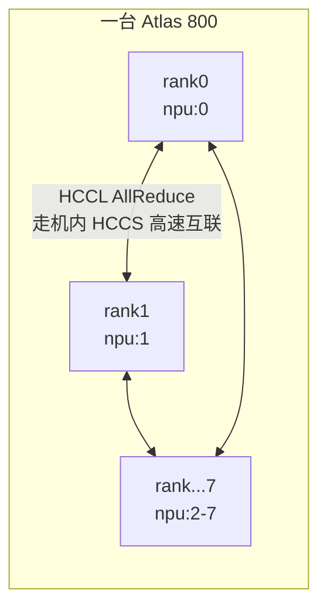

# 第 3 章 · 8 卡分布式：torchrun + DDP + HCCL

> **本章目标**：理解昇腾上的分布式训练机制（HCCL），用 `torchrun` 把第 2 章的迷你 GPT 扩到 8 卡数据并行，并实测 8 卡之间的通信带宽。这一章的启动方式、环境变量、排障思路，适用于后面所有章节——LLaMA-Factory、DeepSpeed、MindSpeed 底层跑的都是同一套东西。

**前置条件**：完成第 2 章（单卡训练跑通）。

## 3.1 概念对齐：五个名词

| 名词 | 含义 | 8 卡单机场景下的取值 |
|---|---|---|
| `world_size` | 参与训练的进程总数 | 8 |
| `rank` | 进程的全局编号 | 0–7 |
| `local_rank` | 进程在本机的编号 | 0–7（单机时等于 rank） |
| backend | 集合通信后端 | **`hccl`**（对标 NCCL） |
| DDP | DistributedDataParallel：每卡一份完整模型，反向时 AllReduce 平均梯度 | 数据并行的标准实现 |

工作方式一句话：**`torchrun` 起 8 个一模一样的进程，每个进程绑一张卡，各算各的 batch，反向传播时通过 HCCL 把梯度求平均，从而保持 8 份权重永远一致。**



## 3.2 把单卡代码改成 DDP：只需四处改动

```python
import os, torch, torch_npu
import torch.distributed as dist
from torch.nn.parallel import DistributedDataParallel as DDP

# ① 初始化进程组：backend 用 hccl（CUDA 上是 nccl，其余完全一致）
dist.init_process_group(backend="hccl")
rank = dist.get_rank()
local_rank = int(os.environ["LOCAL_RANK"])   # torchrun 注入的环境变量

# ② 每个进程绑定自己的卡（必须在建任何 npu 张量之前）
torch.npu.set_device(local_rank)

# ③ 模型上卡后用 DDP 包一层
model = TinyGPT(...).npu()
model = DDP(model, device_ids=[local_rank])

# ④ 数据用 DistributedSampler 切分，保证 8 个进程拿到不同数据
sampler = torch.utils.data.DistributedSampler(dataset)
loader = torch.utils.data.DataLoader(dataset, sampler=sampler, ...)
for epoch in range(epochs):
    sampler.set_epoch(epoch)        # 别忘了，否则每个 epoch 数据顺序相同
    ...
```

其余训练逻辑（AMP、裁剪、optimizer）一行不用改。**打印日志、保存 checkpoint 只在 rank0 做**，这是分布式代码的基本礼仪，否则 8 个进程一起写文件会互相覆盖。

## 3.3 启动：torchrun 一行搞定

```bash
# 8 卡单机启动（本章脚本已封装成 run_ddp_8npu.sh）
torchrun --nproc_per_node=8 --master_port=29500 ddp_tiny_gpt.py

# 只用部分卡：用 ASCEND_RT_VISIBLE_DEVICES 控制（对标 CUDA_VISIBLE_DEVICES）
ASCEND_RT_VISIBLE_DEVICES=0,1,2,3 torchrun --nproc_per_node=4 ddp_tiny_gpt.py
```

跑本章的完整示例：

```bash
bash 03-multi-card-ddp/run_ddp_8npu.sh
```

示例输出（示意）：

```text
[rank0] world_size=8  device=npu:0  params=1.82M  amp=bf16
[rank0] epoch 1 | step   50 | loss 4.83 | global 96.4k tok/s (12.1k tok/s/卡)
[rank0] epoch 2 | step  100 | loss 3.19 | global 97.0k tok/s
...
[rank0] 训练完成, checkpoint 已保存到 tiny_gpt_ddp.pt
```

> ✅ **检查点**：对比第 2 章的单卡 tok/s，8 卡 global 吞吐应达到单卡的 **6.5–7.8 倍**（小模型通信占比高，达不到 8 倍满线性是正常的；7B 级模型 DDP 线性度通常更好）。同时 `npu-smi info` 应显示 8 张卡都有进程、显存占用相近。

## 3.4 实测 8 卡通信带宽

分布式训练性能 = 计算 + 通信。先给你的机器测个底，以后遇到「多卡比单卡还慢」的问题时有基线可对比：

```bash
torchrun --nproc_per_node=8 03-multi-card-ddp/allreduce_bench.py
```

示例输出（示意，数值因机型/版本而异）：

```text
world_size=8  backend=hccl  dtype=float32
      size      time/iter      algbw       busbw
    4.0 MB       0.21 ms     19.8 GB/s    34.6 GB/s
   64.0 MB       1.95 ms     34.3 GB/s    60.1 GB/s
  256.0 MB       7.21 ms     37.2 GB/s    65.0 GB/s
 1024.0 MB      28.55 ms     37.6 GB/s    65.8 GB/s
```

怎么读：

- **algbw**（算法带宽）= 数据量 / 时间；**busbw**（总线带宽）= algbw × 2(n-1)/n，反映硬件链路的实际压力，用于跨机型比较。
- 单机 8 卡走 **HCCS** 互联，大包 busbw 应达到几十 GB/s 量级且随包变大趋于饱和。如果大包带宽也只有个位数 GB/s，说明拓扑或环境有问题（去第 9 章）。
- 小包带宽低是正常的（延迟主导）。这就是为什么 DDP 要把梯度攒成 bucket 再通信（默认 25MB，第 8 章会调它）。

CANN 还自带更专业的压测工具 `hccl_test`（在 `$ASCEND_TOOLKIT_HOME/tools/hccl_test`，需要 MPI 编译），做机器验收时可以用它跑全套 collective 基准；日常用本章的 python 脚本够了。

## 3.5 HCCL 的几个关键环境变量

现在先知道存在，排障细节在第 9 章：

| 变量 | 默认 | 作用 |
|---|---|---|
| `HCCL_CONNECT_TIMEOUT` | 120（秒） | 建链超时。进程组很大或启动慢时调大 |
| `HCCL_EXEC_TIMEOUT` | 1836（秒） | 通信等待超时。**8 卡里有一个 rank 卡住/变慢，其他 7 个会在这个时间后报错退出**——看到 HCCL timeout 报错，真凶通常是没报错的那个 rank |
| `HCCL_BUFFSIZE` | 200（MB） | HCCL 通信缓冲区大小 |
| `HCCL_DETERMINISTIC` | false | 设为 `true` 使归约顺序确定（复现实验用，略降性能） |
| `ASCEND_RT_VISIBLE_DEVICES` | 全部 | 控制进程可见的卡 |

## 3.6 常见坑

| 症状 | 原因与处理 |
|---|---|
| 起了 8 个进程全挤在 npu:0，显存爆 | 忘了 `torch.npu.set_device(local_rank)`，或在 set_device 之前就建了张量 |
| `Address already in use` | 上一次训练的进程没死干净：`pkill -9 -f ddp_tiny_gpt`；或换 `--master_port` |
| 卡住不动，最后 HCCL timeout | 某个 rank 先挂了或走了不同分支（如只有 rank0 做 eval 而其他 rank 在等 AllReduce）。保证**所有 rank 执行相同的集合通信序列** |
| 每个 epoch loss 曲线一样 | 忘了 `sampler.set_epoch(epoch)` |
| Ctrl-C 后再启动报设备占用 | 残留进程还占着卡：`npu-smi info` 看进程，`kill -9` 之，几秒后显存自动释放 |
| 8 卡吞吐远低于单卡×8 | 小模型正常；大模型不正常，去第 7 章 profile 通信占比 |

## 3.7 练习

1. 分别用 1/2/4/8 卡跑 `ddp_tiny_gpt.py`（改 `--nproc_per_node`），画出吞吐-卡数曲线，计算并行效率。
2. 把 `allreduce_bench.py` 的 dtype 换成 `float16` 再测一遍，思考为什么梯度通信量减半对训练意味着什么（第 8 章 DDP fp16 梯度压缩会呼应）。
3. 故意在 rank0 上 `time.sleep(30)` 模拟慢节点，观察其他 rank 多久后报什么错——这个错误信息以后你会经常见到，提前认识它。

**下一章** → [第 4 章 · 实战一：8 卡 LoRA 微调 Qwen](../04-lora-finetune/README.md)：训练真正的大模型。
