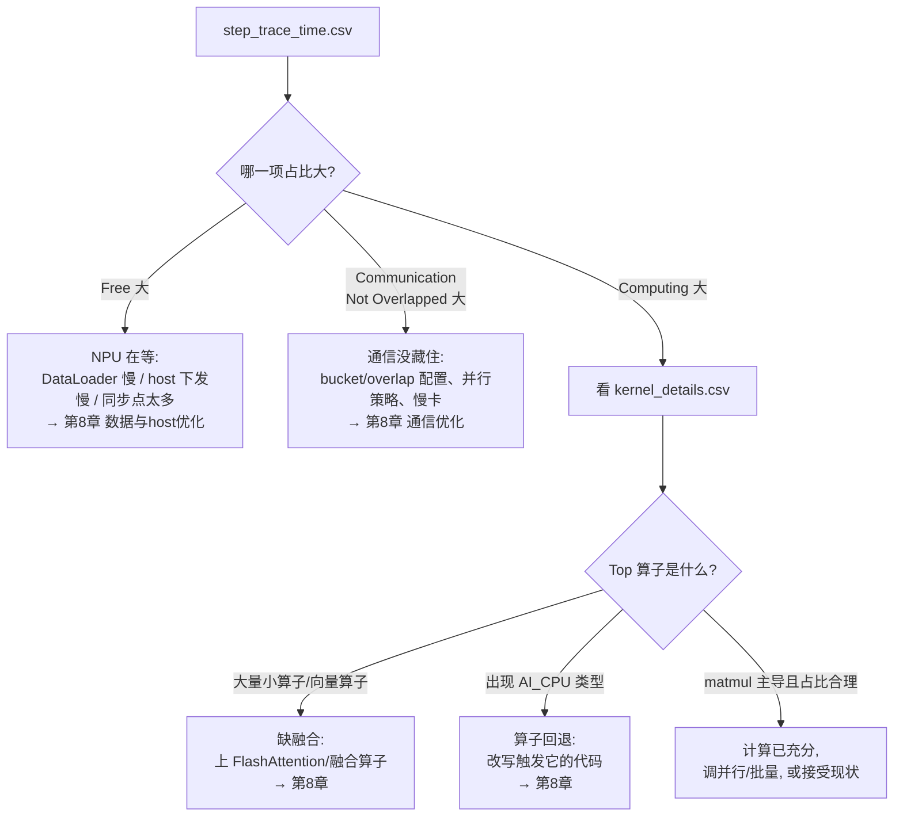

# 第 7 章 · 性能剖析：知道慢在哪，才谈得上优化

> **本章目标**：建立「测量 → 归因 → 优化 → 复测」的方法论。学会用三层工具看清训练性能：`npu-smi`（体感）→ 吞吐/MFU（量化总分）→ Ascend PyTorch Profiler（逐算子归因）。第 8 章的每一项优化，都应该由本章的数据来决定做不做、做完有没有效。

**前置条件**：手头有一个在跑的训练任务（第 3~6 章任一）。

## 7.1 三层观测法

| 层级 | 工具 | 回答的问题 | 成本 |
|---|---|---|---|
| L0 体感 | `npu-smi info` | 卡忙不忙？显存水位多少？8 卡均衡吗？ | 零 |
| L1 总分 | tokens/s + **MFU**（[`mfu.py`](mfu.py)） | 算力发挥了几成？值不值得优化？ | 一次计算 |
| L2 归因 | **Ascend PyTorch Profiler**（[`profile_tiny_gpt.py`](profile_tiny_gpt.py)） | 时间具体花在哪个算子/哪次通信/哪段空闲？ | 采样几步 |

## 7.2 L0：npu-smi 快速体检

训练时开着 `watch -n 1 npu-smi info`，三个信号一眼判断：

- **AICore(%) 长期高位（如 >80%）**：计算饱和，瓶颈大概率在算子效率 → 直接看 L2 的算子榜。
- **AICore(%) 周期性掉到低位**：有等待——数据加载、通信、或 host 下发慢 → 看 L2 的 Free/通信占比。
- **8 张卡忙闲不均**：负载不均衡（数据长短差异大、并行切分不均）或某张卡降频。

## 7.3 L1：吞吐与 MFU——训练性能的「统一考分」

**MFU（Model FLOPs Utilization）= 模型有效计算量 / (硬件峰值算力 × 时间)**。它把模型大小、batch、卡数都归一化掉，是跨任务、跨机器可比的指标。

估算公式（GPT 类模型，本课程用 PaLM 论文口径）：

```text
每 token 计算量 ≈ 6N + 12·L·H·S     （N=参数量, L=层数, H=hidden, S=序列长）
MFU = 每token计算量 × 吞吐(tokens/s) / (卡数 × 单卡峰值FLOPS)
```

用本章脚本算，只需要从训练日志抄两个数（全局 batch 和单步耗时）：

```bash
python 07-profiling/mfu.py --model-size 7e9 --layers 28 --hidden 3584 \
    --seq 4096 --global-batch 64 --step-time 13.1 --npus 8 --peak-tflops 320
```

```text
每 token FLOPs: 4.69e+10   (6N=4.20e+10, attn项=4.93e+09)
吞吐: 20.0k tokens/s (2.5k tokens/s/卡)
单卡实际算力: 117.4 TFLOPS  (峰值按 320 计)
MFU: 36.7%
```

> 关于 `--peak-tflops`：910A 官方 FP16 峰值 320 TFLOPS；**910B 各子型号峰值未统一公开**，社区常用 313~400 TFLOPS 口径估算——把它当「同一台机器上前后对比」的常数即可，别跨口径比较绝对值。

**经验参考区间**（规则粗略，仅供定位）：调优到位的稠密模型预训练 MFU 常见 **30%~45%+**；低于 20% 通常说明存在明显瓶颈（数据、通信、AI CPU 算子、并行策略不当），值得进入 L2 深挖；LoRA/短序列微调因计算密度低，MFU 天然偏低，更适合直接比 tokens/s。

## 7.4 L2：Ascend PyTorch Profiler——逐算子归因

`torch_npu.profiler` 的用法与原生 `torch.profiler` 几乎一致，往训练循环里包一层即可（完整可运行示例见 [`profile_tiny_gpt.py`](profile_tiny_gpt.py)）：

```python
import torch_npu

experimental_config = torch_npu.profiler._ExperimentalConfig(
    profiler_level=torch_npu.profiler.ProfilerLevel.Level1,   # Level0 更轻, Level2 最细
    aic_metrics=torch_npu.profiler.AiCMetrics.PipeUtilization,
)
with torch_npu.profiler.profile(
    activities=[torch_npu.profiler.ProfilerActivity.CPU,
                torch_npu.profiler.ProfilerActivity.NPU],
    # 只采样中间几步: 跳过编译预热, 控制产物体积
    schedule=torch_npu.profiler.schedule(wait=1, warmup=2, active=3, repeat=1),
    on_trace_ready=torch_npu.profiler.tensorboard_trace_handler("./prof"),
    record_shapes=True, profile_memory=True, with_stack=False,
    experimental_config=experimental_config,
) as prof:
    for step, batch in enumerate(loader):
        train_step(batch)
        prof.step()                      # 别忘了, 驱动 schedule 前进
```

跑完在 `./prof/<主机名>_<pid>_ascend_pt/ASCEND_PROFILER_OUTPUT/` 下得到一组文件，**最常用的三个**：

| 文件 | 内容 | 怎么用 |
|---|---|---|
| `trace_view.json` | 完整时间线（CPU 侧调用 + NPU 算子 + 通信） | 导入 **MindStudio Insight** 图形化查看 |
| `step_trace_time.csv` | 每步的 **Computing / Communication(Not Overlapped) / Free** 分解 | 三分天下，先看谁大 |
| `kernel_details.csv` | 每个 NPU kernel 的耗时/形状/类型 | 排序找 Top 算子和 **AI_CPU** 算子 |

### 归因决策树



### 看结果的两种方式

1. **MindStudio Insight**（推荐）：昇腾官方的可视化工具（从昇腾社区下载，装在自己电脑上），打开 `*_ascend_pt` 目录即可看时间线、算子榜、通信矩阵。找「空洞」（NPU 时间线上的空白段）特别直观。
2. **直接读 CSV**：服务器上没图形界面时，`kernel_details.csv` 用 pandas 排个序就是算子榜：

```python
import pandas as pd
df = pd.read_csv("kernel_details.csv")
print(df.groupby("Type")["Duration(us)"].sum().sort_values(ascending=False).head(15))
# 若在 Type/Accelerator Core 列看到 AI_CPU —— 恭喜, 找到一个典型优化点(第 8 章 8.4)
```

另有命令行分析工具 `msprof-analyze`（`pip install msprof-analyze`），可以对采集结果自动扫描常见问题（advisor 模式）、做多卡间对比（cluster 模式），集群调优时很好用，入门阶段可选。

## 7.5 profiling 的纪律

1. **先预热再采样**：首步含编译/缓存建立，必须用 `schedule` 跳过，否则结论全错。
2. **采样窗口要小**：active 3~5 步足够，trace 文件动辄几百 MB。
3. **多卡时每个 rank 都会产出目录**：一般看 rank0 + 随机抽一个非 0 rank 对比；怀疑负载不均时全看。
4. **profiling 本身有开销**（Level 越高越大）：定位问题用 Level1，测「真实吞吐」时要关掉 profiler。
5. **一次只改一个变量**：优化后复测同一工况，diff 两份 `step_trace_time.csv` 说话。

## 7.6 动手

```bash
# 单卡剖析迷你 GPT（几分钟, 生成 ./prof 目录）
python 07-profiling/profile_tiny_gpt.py

# 8 卡剖析（观察通信项; 只让 rank0 采样以省空间）
torchrun --nproc_per_node=8 07-profiling/profile_tiny_gpt.py --distributed
```

> ✅ **检查点**：你能对自己的训练任务说出这三个数——**MFU 多少、step 时间三分量各占多少、Top-5 算子是谁**。能说出来，第 8 章每一节该不该做、优先级如何，答案自动浮现。

## 7.7 练习

1. 给第 3 章的 DDP 训练做 profile，量出通信未重叠时间占比；把模型换大 4 倍再测，观察占比变化。
2. 故意把 DataLoader `num_workers` 设为 0 制造数据瓶颈，确认 Free 占比上升，再调回去验证恢复——完成一次完整的「归因-修复-复测」闭环。
3. 用 `mfu.py` 算一下第 6 章预训练的 MFU，记下来作为第 8 章优化前的基线。

**下一章** → [第 8 章 · 性能优化实战](../08-optimization/README.md)：带着画像去开药。
