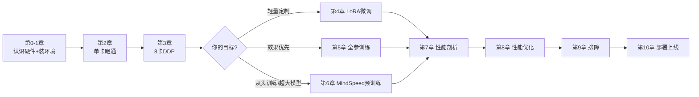

# 华为昇腾 910 · 8 卡大模型训练实战课程

> 用一台 8 卡昇腾 910 服务器，从零把大模型的**微调、全参训练、预训练**跑起来，并把**性能调到位**。

这是一套面向工程实践的系列教程。所有章节围绕同一个硬件假设展开：**单台服务器、8 张昇腾 910 NPU**（典型机型为 Atlas 800 训练服务器）。每一章都有明确的产出物：要么是一段跑通的训练，要么是一份能落地的调优/排障手段。

## 你将学到什么

- 把驱动、CANN、`torch_npu` 装对，并**验证**每一层都正常（第 1 章）
- 把熟悉的 PyTorch/CUDA 习惯**平移到 NPU**，单卡跑通训练（第 2 章）
- 用 `torchrun + HCCL` 把 8 张卡组成数据并行集群（第 3 章）
- 用 LLaMA-Factory / transformers+PEFT 完成 **8 卡 LoRA 微调**（第 4 章）
- 用 DeepSpeed ZeRO 在 8 卡上做 **7B 级全参训练**（第 5 章）
- 用 MindSpeed(-LLM) 跑 **Megatron 风格预训练**：TP/PP/SP/重计算（第 6 章）
- 用 Ascend PyTorch Profiler + MindStudio Insight **找出性能瓶颈**、计算 MFU（第 7 章）
- 系统化的**性能优化**：精度、融合算子、显存、通信、数据流水线（第 8 章）
- 常见故障（HCCL 超时、OOM、NaN、卡死）的**定位与恢复**（第 9 章）
- 训练完的模型如何用 vLLM-Ascend / MindIE **部署推理**（第 10 章）

## 课程目录

| 章节 | 主题 | 产出物 |
|---|---|---|
| [第 0 章](00-overview/README.md) | 昇腾 910 硬件与软件生态全景 | 看懂自己的机器和技术选型 |
| [第 1 章](01-environment/README.md) | 环境搭建与验证 | 一套通过全部自检的训练环境 |
| [第 2 章](02-single-card/README.md) | PyTorch NPU 上手与单卡训练 | 单卡训练一个迷你 GPT |
| [第 3 章](03-multi-card-ddp/README.md) | 8 卡分布式：torchrun + DDP + HCCL | 8 卡数据并行训练 + 通信带宽实测 |
| [第 4 章](04-lora-finetune/README.md) | 实战一：8 卡 LoRA 微调 Qwen | 微调出一个自己的对话模型 |
| [第 5 章](05-full-finetune-deepspeed/README.md) | 实战二：DeepSpeed ZeRO 全参训练 | 8 卡全参微调 7B 模型 |
| [第 6 章](06-pretrain-mindspeed/README.md) | 实战三：MindSpeed 预训练（TP/PP） | Megatron 风格预训练跑通 |
| [第 7 章](07-profiling/README.md) | 性能剖析与 MFU | 拿到自己训练任务的性能画像 |
| [第 8 章](08-optimization/README.md) | 性能优化实战 | 一份可逐项落地的优化清单 |
| [第 9 章](09-troubleshooting/README.md) | 稳定性与故障排查 | 排障手册 + 一键诊断脚本 |
| [第 10 章](10-inference/README.md) | 番外：推理部署 | 用 vLLM-Ascend 起一个 OpenAI 兼容服务 |
| [附录 A](appendix/version-matrix.md) | 版本配套速查 | 避免 90% 的环境问题 |
| [附录 B](appendix/cheatsheet.md) | 命令与环境变量速查表 | 贴在工位上的那张纸 |
| [附录 C](appendix/cuda-to-npu.md) | CUDA → NPU 迁移对照表 | 老 CUDA 用户的翻译词典 |

## 学习路径



赶时间的话：**1 → 2 → 3 → 4** 是最短可用路径（两三个小时内可以微调出第一个模型）；第 7、8 章在你开始在意训练速度时再回来看。

## 硬件与版本基线

教程所有示例基于以下基线编写。版本相关的内容集中在[附录 A](appendix/version-matrix.md)，正文尽量不重复具体版本号。

| 项目 | 基线 | 说明 |
|---|---|---|
| 服务器 | Atlas 800 训练服务器（8 × Ascend 910） | 其他 8 卡 910 整机同样适用 |
| NPU 芯片 | 以 **910B（Atlas A2，单卡 64GB HBM）** 为主 | 910A（32GB）的差异会单独标注 |
| CPU / 架构 | 鲲鹏 920，**aarch64** | 部分整机是 x86，装包时注意架构 |
| 操作系统 | openEuler / Ubuntu（Linux） | |
| CANN | 8.x（示例以 8.1.RC1 为基线） | |
| Python | 3.10 | |
| PyTorch / torch_npu | 2.5.1 / 2.5.1 | 两者版本必须严格配套 |

> ⚠️ **昇腾软件栈迭代很快。** 本教程写作基线为 2026 年上半年的稳定组合，安装任何组件前，请先对照[附录 A](appendix/version-matrix.md) 和官方配套表确认版本关系。教程中的原理、工作流和排障方法是长期稳定的，具体版本号不是。

## 快速开始

```bash
git clone https://github.com/zky001/hw910_llm_course.git
cd hw910_llm_course

# 1. 检查机器现状（驱动/CANN/torch_npu 装没装、装的什么版本）
bash 01-environment/check_env.sh

# 2. 环境没问题的话，跑一个单卡 "hello world"
python 02-single-card/hello_npu.py

# 3. 然后 8 卡跑起来
bash 03-multi-card-ddp/run_ddp_8npu.sh
```

## 约定

- 命令行以 `$` 开头的是在普通 shell 执行；需要 root 的会写 `sudo` 或明确说明。
- 所有「示例输出」都是**示意**，你的版本号、数值会不同，关注结构而不是具体数字。
- 教程主线走 **PyTorch（torch_npu）路线**，这是社区生态最好、迁移成本最低的路线；MindSpore 路线在第 0 章有介绍和选型建议。

## 官方资料入口

- 昇腾社区（文档/驱动/CANN 下载）：<https://www.hiascend.com>
- Ascend Extension for PyTorch（torch_npu）：<https://github.com/Ascend/pytorch> / <https://gitee.com/ascend/pytorch>
- MindSpeed / MindSpeed-LLM：<https://gitee.com/ascend/MindSpeed> / <https://gitee.com/ascend/MindSpeed-LLM>
- LLaMA-Factory：<https://github.com/hiyouga/LLaMA-Factory>
- vLLM-Ascend：<https://github.com/vllm-project/vllm-ascend>

---

*本课程为社区教程，与华为官方无关；涉及的商标归各自所有者。发现内容过期或错误，欢迎提 Issue / PR。*
